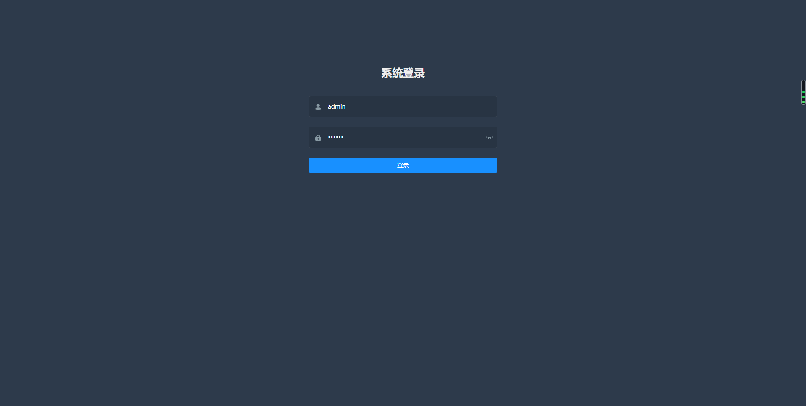

# vue-element-admin-laravel8
基于服务端PHP 【laravel8.4】框架 与【vue-element-admin】框架搭建的角色权限管理基础系统。

#安装运行页面效果

#laravel安装
1.复制跟目录.env.example文件为.env
2.编辑.env中的数据库配置
3.命令行运行：composer install
4.命令行运行：php artisan key:generate
5.命令行运行：php artisan migrate
6.命令行运行：php artisan db:seed